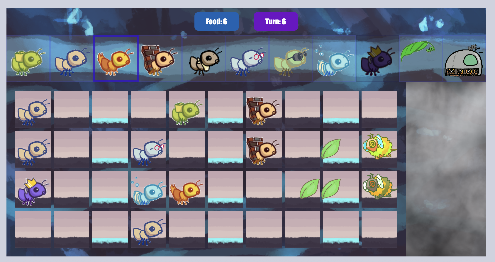

# Ants vs. SomeBees
A Python tower-defense game inspired by Plants vs. Zombies (CS61A).
Built with object-oriented design; includes GUI runner.

## Run
```bash
python3 gui.py
python3 gui.py -d easy


## Screenshots

Gameplay screen:


Ants vs. SomeBees in action:

